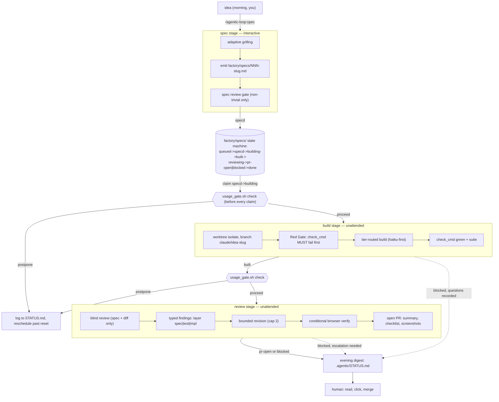

# The factory: hand over ideas in the morning, review PRs in the evening

You write five ideas into `factory/specs/` before your first coffee. By the
time you're back, five branches exist, five PRs are open, each with a
passing check command, a fresh-context review, screenshots where there's a
UI to screenshot, and an executive summary. You read the summaries, click
through the ones that look right, and merge them. That's the promise. This
doc is the honest version of how it works, what it costs, and where it
breaks.

Credit where it's due: inspired by Alex Finn's software-factory workflow
(<https://x.com/alexfinn/status/2076752798532931758>) — three skills, three
loops, a tracker as the coordination bus, chat as the human interface. The
shape is his; everything below this line is this repo's implementation.

## The naive version burns tokens and ships slop

The tempting version — put an agent on a todo list in a `while true` loop
and let it run for eight hours — breaks in three predictable ways.

**Unbounded loops cost real money for no reason.** A loop with no completion
signal keeps "working" until it hits a wall-clock limit, re-deciding things
it already decided. Community reports of $400+ overnight runs aren't
exaggerations; that's what happens when nothing tells the loop it's done.

**A worker that grades its own homework always passes.** If the same context
that wrote the code also judges it, "looks correct to me" is a foregone
conclusion — the anchoring is the problem, not the model.

**Spec-driven development, done by the book, is its own token sink.**
Popular SDD frameworks generate a constitution file, a research file, a
data-model file, a contracts file, and a plan file per feature, regardless
of size — measured at ~8 files / ~1,300 lines for a *trivial* change in one
framework. That ceremony doesn't buy correctness; it buys re-reading.

What this implementation does instead:

- **A completion signal that isn't the model's opinion.** Every spec carries
  a `check_cmd` — one shell command whose exit status decides "done." No
  stage advances on a claim; it advances on an exit code.
- **The reviewer never sees the builder's reasoning.** Review gets the spec
  and the diff only — a blind, fresh-context pass structurally incapable of
  rubber-stamping prior work it never saw.
- **One spec file, sized to the idea.** No constitution, no research doc, no
  contracts file. Trivial ideas get one confirmation question; large ideas
  get up to five grilling questions. Either way, one file.
- **Every loop is bounded.** One spec per build invocation, one per review
  invocation, a hard revision cap of two, a usage gate checked before every
  claim.

## Architecture



The state machine lives in `factory/specs/*.md` frontmatter, enforced by
`scripts/lib/tracker.sh`. The usage gate sits in front of both `claim`
calls — build and review each check it before touching the queue. If you
remember one thing about where cost control lives, it's that line.

## The spec stage

`/agentic-loop:spec "idea"` is the one interactive step. Every question it
skips becomes a wrong guess downstream; every question it asks costs your
morning. Adaptive depth resolves that:

1. **Triage `effort_budget` first** — one seam or several, easily reversible
   or not, answered from the codebase where possible. `trivial`/`small` gets
   one confirmation question, then the spec is emitted directly.
   `medium`/`large` gets full grilling, capped around five user-facing
   questions — a sixth is replaced by a stated assumption.
2. **Grill one question at a time**, walking a decision tree, exploring the
   repo between questions so it never asks what it can read.
3. **Emit one spec file** from `templates/factory-spec.md`.

Field by field: **frontmatter** (id/title/status/`profile` — `hardened` is
a reserved flag for correctness-critical work, tooling not built yet, see
Roadmap) carries the tracker's state machine. **objective** is one
imperative sentence ("and also" means two specs). **user_intent_verbatim**
is your words, uncut — it stops telephone-game drift downstream.
**input_paths** are the seams touched, paths only, never inlined content.
**boundaries_non_goals**, **output_spec**, and **effort_budget** set scope,
done-state, and the tier/grilling-depth driver. **Acceptance** is RFC-2119
SHALL + Given/When/Then, one step from a test.

**check_cmd** is the highest-leverage field in the spec: one command, one
exit code, decides done-ness for every downstream stage. It's why the
pipeline needs no data-model or contracts file — a prose spec a machine
can't check is exactly the ceremony that makes classic SDD expensive. If
acceptance references UI behavior, the spec notes it so review knows to
open a browser. **Notes** are append-only and rare — only when a decision
is hard-to-reverse, surprising, and a real trade-off. **Revision log** is
deltas only; a spec is never regenerated.

Deliberately **not** generated: constitution, research, data-model, or
contracts files. If the spec skill starts producing a second file per idea,
that's a regression.

Non-trivial specs get one more gate: a fresh-context `loop-reviewer` pass on
the spec alone, hunting ambiguity, missing edge cases, implicit assumptions,
and a `check_cmd` that could pass vacuously — the cheapest possible moment
to catch a spec flaw, before a build is wasted on it.

## The build stage

`/agentic-loop:build` runs unattended, one spec per invocation.

**Claim semantics.** `tracker.sh claim specd building build-loop` atomically
moves the oldest `specd` item to `building` under a `mkdir` lock. Whoever
holds the claim is the sole writer of that file until it advances again.
Empty queue → log `build idle: no specd items` and stop, no polling.

**Worktree isolation.** Build happens on a dedicated `git worktree`, branch
`claude/idea-<slug>` — never the main checkout. A prior `blocked` attempt
reuses the same branch. This is what lets build and review for *different*
ideas run concurrently without colliding.

**Red Gate, and the vacuous-check case.** Before any implementation, the
build stage writes the test `check_cmd` runs and confirms it **fails** —
mechanical, an exit code, not an LLM call. A check that already passes on
the untouched codebase is checking nothing; when that happens the skill
records it in the spec's Revision log, marks the spec `blocked`, and
stops rather than building anyway.

**Tier routing, haiku-first.** Mechanical work goes to `loop-worker-cheap`
(haiku) or the Ollama shim; judgment work goes to sonnet-tier subagents;
escalation is one tier on *measured* failure, never by default. Every
worker envelope is validated — status, `artifacts[]` on disk,
`key_decisions`/`caveats` carried into the spec's Notes.

**Unattended rules.** Blocked beats guessed: any `needs_input`, or
`check_cmd` still failing after two escalated attempts, sets `blocked` with
the question or failure recorded, and the next item starts on the next
invocation. No metered tiers unattended: `call_sol.sh`/`call_fable.sh` are
never called on the build stage's own initiative — a structural trigger
records `needs_escalation` in the spec's Notes for your evening decision, no
autonomy exception, day or night.

A green `check_cmd` that breaks the rest of the suite doesn't count — the
existing project suite runs too. Once green, the stage commits on the
branch and stops. It never pushes, never opens a PR — nothing reaches the
remote before blind review sees it.

## The review stage

`/agentic-loop:review` is the gate between an unattended build and your
evening. Nothing merges here; the terminal state is an open PR plus one
digest line.

**Blind protocol.** The stage claims the oldest `built` item and hands the
`loop-reviewer` subagent exactly the spec file and
`git diff main...claude/idea-<slug>` — never the build stage's reasoning or
intermediate attempts.

**Review dimensions, evidence-first:** spec fidelity (does the diff satisfy
each SHALL, or did the tests encode a misunderstanding?), security (input
validation, injection, authz assumptions), optimization (inefficient
patterns, hidden coupling, resource leaks), test quality (tautological
tests, over-mocking, implementation-detail assertions, behavior the code
added that the spec never asked for). Every finding carries
`layer: spec|test|impl` and a severity. The reviewer runs `check_cmd` and
the project suite itself — a claim without a non-LLM check is an opinion.

**Bounded revision, hard cap 2, routed by layer.** `impl` findings fix the
branch and re-run `check_cmd`; `test` findings get a test that must *fail*
against the pre-fix code first (Red Gate applies to revisions too), then
gets fixed; `spec` findings become a Revision-log delta, and if the delta
needs a decision only you can make, the item goes `blocked`. A second round
happens only if the first materially changed the artifact and a check still
fails; after the cap, ship with stated caveats or block — never a third
round, since self-refine gains concentrate in the first two. Same rule as
build for structural triggers: recorded as `needs_escalation` in the
digest, never spent.

**Browser verification, conditional.** Only when the project has a runnable
web UI *and* the spec's acceptance references UI behavior: launch the app,
drive each Given/When/Then with Playwright (Chromium preinstalled on Claude
Code cloud sessions), screenshot each scenario, write manual test steps.
CLI/library changes skip this — it's the most expensive pass, so it runs
only where it observes something. Screenshots + test steps in the PR body
are the default preview, $0, sufficient for most evening reviews. For
static/front-end changes the stage additionally publishes a self-contained
HTML preview as a **private Claude Artifact** — subscription-covered, no
separate hosting account. Heavier options (a GitHub Pages preview branch, a
Codespaces badge, Cloudflare Pages, Vercel/Netlify hobby tiers) are
documented project hooks, used only if already wired up.

**PR anatomy.** Push the branch, open a PR: title = spec title; body =
executive summary (≤10 lines), acceptance checklist with pass/fail, manual
test steps, screenshots, caveats carried from envelopes, spec file
reference. No remote configured → record `pr: local` and note the branch in
the digest instead. Every completed item also appends one digest line to
`.agentic/STATUS.md` — this, multiplied by however many ideas cleared, is
what you read in the evening:

```
pr-open: 004 Add rate-limit retry — https://github.com/you/repo/pull/12 | tests: pass | caveats: 1 | escalation: no
```

## Running the factory

**Day mode (recommended): one session, `/loop 60m`.**

1. Install the usage-tracking statusline once per project, in
   `.claude/settings.json` (`/agentic-loop:init` already copies the script
   to `scripts/`; `./scripts/doctor.sh` checks it's present):

   ```json
   {"statusLine": {"type": "command", "command": "scripts/statusline-usage.sh"}}
   ```

2. Fill the queue in the morning — each call is a short interactive exchange
   that ends with a `factory/specs/` file at `status: specd`:

   ```
   /agentic-loop:spec "add retry with backoff to the webhook sender"
   /agentic-loop:spec "let users export their data as CSV"
   /agentic-loop:spec "fix the flaky date-parsing test"
   ```

3. Start the loop and walk away: `/loop 60m /factory`. `/factory` is
   `templates/workflows/factory.js` (copy to `.claude/workflows/factory.js`
   to enable). Each firing: a haiku scout checks the usage gate and lists up
   to `maxIdeas` (default 2) queued specs, then runs build→review per idea
   through `pipeline()` — idea B can build while idea A reviews, worktree
   isolation keeps them apart. Cheapest mode per idea: one session, one
   scout pass, sonnet-tier build/review with haiku underneath.

4. In the evening, read `.agentic/STATUS.md`, open the PRs that look right,
   merge yourself. Nothing here merges anything.

**The parallel-sessions alternative.** Background two sessions —
`/loop 30m /agentic-loop:build` and `/loop 30m /agentic-loop:review` — as
independent loops instead of one pipeline. Strictly more parallelism (build
never waits on review), but both draw from the *same* shared 5-hour/weekly
caps as everything else you do that day, so a queue of the same size drains
the usage gate's threshold faster. Reach for it with a large queue and idle
budget, not as the default.

**Cloud/headless — deferred to advanced use.** `scripts/run_headless.sh` is
a gated `claude -p` loop wrapper: refuses without
`--i-understand-billing`, requires `--check-cmd`, treats a subscription cap
error as a structured "postponed" exit rather than retrying. Routines
(scheduled, fresh-session-per-fire) are the other cloud path. Both work with
the factory's file-based state machine, but v1 only documents the recipe —
a `--queue` extension and a Routine template are v2 (Roadmap). Read the
billing warning at the top of the script before you start.

## The usage gate

The gate exists because the biggest field-reported failure mode for
unattended loops isn't a bad PR — it's a loop that keeps trying to work
after the budget is gone, burning retries against a wall.

**How it works.** `/usage` (interactive, TUI-only) is the only first-party
place to *see* percent-of-cap — no `-p` form, no `claude usage` subcommand,
and community estimators (ccusage, claude-monitor) only *infer* it from
local transcripts. What's actually exposed programmatically is the
statusline JSON's `rate_limits.{five_hour,seven_day}.used_percentage` /
`.resets_at` — the one place Anthropic hands you the real number.
`templates/statusline-usage.sh` renders the statusline **and** mirrors
those fields to `.agentic/usage.json` on every update, which happens to be
exactly the day-mode setup: the looping session keeps its own mirror fresh
just by being alive.

`scripts/lib/usage_gate.sh check` reads that file before build or review
claims work: any window at or above threshold (default 90%,
`FACTORY_USAGE_THRESHOLD`) → exit 5, postpone until the *latest* reset among
over-threshold windows (waiting for the sooner one alone could still leave
you capped on the other). Missing or stale file (default >120 minutes,
`FACTORY_USAGE_STALE_MINUTES`) → **fail open** with a stderr warning, so a
broken statusline can't deadlock the factory. Otherwise proceed. The
backstop for that optimistic fail-open: `run_headless.sh` greps for the
literal "hit your session/weekly limit" text, parses the reset time, and
exits postponed instead of burning further iterations.

**To push past the cap:** `/usage-credits` buys overage with a spend cap you
set — the sanctioned way through a capped window. The gate doesn't manage
this for you; it's a lever you pull when the evening's queue is worth it.

## Costs

Per medium idea in day mode: one haiku scout pass, one build (haiku-first,
escalating only on measured failure), one spec-review gate pass, one
fresh-context review, up to two bounded revisions. **All subscription-
covered.** Nothing metered runs unless a structural trigger fires — and even
then the pipeline only *records* `needs_escalation`, never spends. You see
flagged items in the evening digest and decide per item. Approved spend
routes through the same Sol/Fable shims and tier ladder as the rest of the
project — roughly $0.25–$1.50 per Sol pass depending on effort, per the
project `CLAUDE.md` cost calibration, not a factory-specific price.

So the honest number: **$0 metered per idea, by default, for the whole
day**, bounded by your subscription's shared caps, which the usage gate
protects. What it costs instead is time inside those caps — running the
factory all day competes with everything else you use Claude Code for.

Restated as costs it doesn't pay: no $400 overnight surprise (every loop
bounded, gate before every claim); no silent auth-method billing flip
(`ANTHROPIC_API_KEY` is read only by metered shim scripts from `.env`, never
the interactive session — `doctor.sh` checks this); no retry-storm against a
capped window (`run_headless.sh` recognizes a cap error and stops); no merge
you didn't make (terminal state is always an open PR).

## Tracker connectors

`scripts/lib/tracker.sh` is a small, deliberate seam: every skill and
workflow goes through five functions and never touches spec frontmatter
directly.

```
tracker.sh list <status>              matching spec paths, oldest first
tracker.sh claim <from> <to> <actor>  atomically claim oldest <from> item
tracker.sh advance <file> <status> [key value]...   set status + fields
tracker.sh next-id                    next zero-padded id (e.g. 004)
tracker.sh report                     per-status counts + item lines
```

The shipped backend is plain files: `factory/specs/NNN-slug.md`, a `status:`
frontmatter field as the state machine, claims serialized through an atomic
`mkdir` lock, single-writer-per-claim. Because every caller goes through
this interface rather than reading frontmatter itself, a GitHub Issues or
Jira backend is a drop-in replacement: implement the same five functions
against the Issues or Jira API (status → a label or workflow state, claim →
assignee + label transition, list → a filtered search), keep the
signatures, and nothing in `skills/spec`, `skills/build`, `skills/review`,
or `factory.js` changes. Not built in v1 — the file backend is
zero-dependency and matches this repo's evidence-backed files+git-as-memory
decision — but the seam exists so it won't require a rewrite later.

## Roadmap (v2)

Deferred on purpose — each is a real feature, but none were needed to make
the core loop trustworthy, and each adds either an external dependency or an
automation risk better earned than assumed: **🚀-comment auto-merge** (a
babysit pass or GitHub-triggered Routine that merges on your
reaction/comment — v1 keeps merge fully manual); **`/autofix-pr` wiring**
(a reviewer comment on an open factory PR triggers a bounded fix pass
instead of waiting for morning); **`run_headless.sh --queue` extension and
Routine templates** (the cloud/headless recipe is documented today, a
tooled path is v2); **GitHub Issues / Jira tracker adapters** (the interface
contract is final, the adapters aren't written); **`profile: hardened`
tooling** (reserved field; mutation testing, fuzzing, formal properties
aren't wired in); **Tutorial Level 4** in `docs/tutorial.html` (this doc
carries the walkthrough until real runs produce screenshots); **Slack/
Channels notification parity** (the digest lives in `.agentic/STATUS.md`
today; pushing it elsewhere is future work).

## FAQ

**Can it merge for me?**
No, not in v1. The terminal state is an open PR with a passing check, a
review, and a digest line — not a merge. Auto-merge on a 🚀 reaction is on
the v2 roadmap; today you click merge yourself.

**Why did my idea end up blocked instead of built?**
One of four things: build hit a question only you can answer; `check_cmd`
still failed after two escalated attempts; the generated check passed
*before* any implementation existed (Red Gate caught a vacuous check); or a
reviewer fix needed a spec-level decision. The spec's Notes/Revision log say
which.

**What happens when I hit my usage cap mid-run?**
`usage_gate.sh check`, run before every claim, sees a window cross 90%, logs
a postponement with the reset time to `.agentic/STATUS.md`, and the loop
stops claiming work until then. No statusline installed → fails open
instead of deadlocking; headless → the literal cap error is the backstop.

**Does this work with API-key billing instead of a subscription?**
It can, but it isn't built for it — the orchestrator and usage gate assume
your subscription's shared caps. `ANTHROPIC_API_KEY` in scope silently
flips interactive billing to metered rates, which `doctor.sh` flags. Run it
that way deliberately (CI, say) and every stage the gate assumes is free now
costs per token.

**Why one spec file instead of a SpecKit-style constitution/plan/
data-model/contracts structure?**
The ceremony doesn't survive contact with token cost: measured at ~8 files
/ ~1,300 lines for a *trivial* feature in one framework, fixed regardless of
size. `check_cmd` replaces the contracts/data-model role — a command a
machine can run beats prose a model re-reads — and the spec review gate
replaces adversarial-review ceremony at a fraction of the cost.

**Can I use Linear (or Jira, or GitHub Issues) instead of files?**
Not out of the box in v1, but the tracker is built for exactly this swap —
`scripts/lib/tracker.sh` is the only thing any skill talks to for queue
state. Implement its five functions against Linear's API and every skill
keeps working unmodified (see Tracker connectors above).

**Why does the reviewer never see what the builder was thinking?**
Because a reviewer that inherits the builder's framing tends to confirm
it — anchoring, not a matter of trying harder. Spec-and-diff-only, cold, is
Anthropic's own documented review pattern, and it's why a `blocked` from
review means something rather than being a formality.

**What if browser verification breaks my headless environment?**
It only runs when the spec's acceptance references UI behavior *and* the
project has a runnable web UI. Skip UI-behavior acceptance criteria and
review falls back to the screenshot/test-steps default at zero cost.
