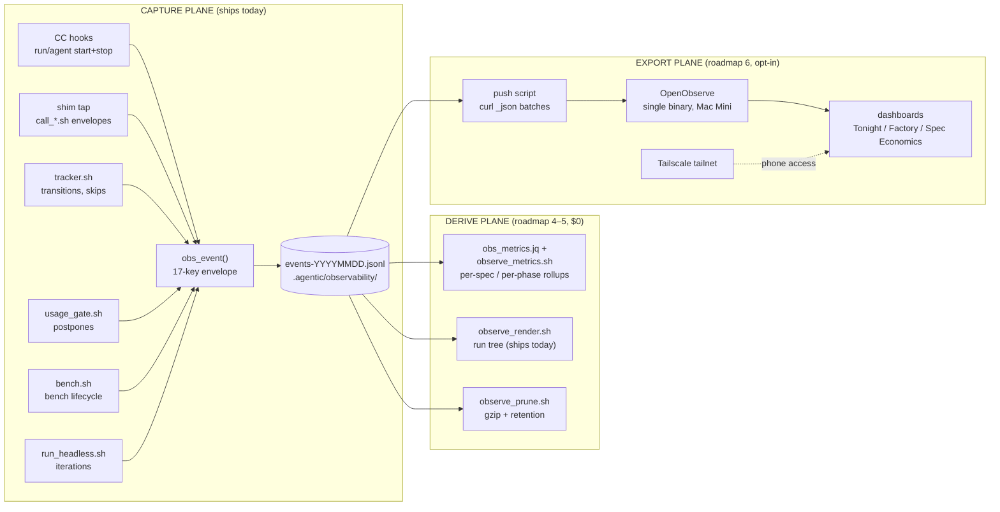

# Observability architecture — strategy, comparison, and roadmap

The full observability strategy for the agentic loop: what we measure, why the
pipeline is shaped the way it is, which platform and hosting won the comparison
(and which lost, with numbers), and the phased roadmap from today's event log to
phone-reachable dashboards.

Companion pages: [`observability.md`](observability.md) is the terse operating
reference for what ships today; [`observability-evals-analysis.md`](observability-evals-analysis.md)
is the original design record. This page is the forward-looking architecture.
Pricing and platform facts below were researched **2026-07** and are dated
inline — recheck before acting on them a quarter later.

---

## 1. Principles

Everything in this document is governed by rules the project already lives by:

1. **The local JSONL envelope is the permanent source of truth.** It is the one
   component that can never break the loop (every capture path exits 0), never
   needs a network, and is already gitignored so nothing leaves the machine by
   accident. Every idea below is a **derive or export layer on top of it** —
   never a replacement, never a second write path.
2. **Nulls are honest.** `est_cost_usd` stays null for subscription-tier work.
   Subscription tokens are shared capacity, not dollars; only genuinely metered
   calls (Fable, Sol, OpenRouter) carry a dollar figure. Dashboards inherit
   this split: a "total cost" panel shows metered $ and subscription tokens as
   two numbers, never a fabricated blend.
3. **Gates, not documentation.** Where a metric depends on data being present
   (a `phase` tag, a `done` stamp), the roadmap adds a mechanical path that
   guarantees it — not a doc asking humans to remember.
4. **Zero standing cost until a phase earns it.** Phases 1–5 of the roadmap run
   on bash + jq with no infrastructure at all. The first component that costs
   RAM (not money) arrives in phase 6, opt-in, with an explicit resource budget.
5. **Fail closed, degrade silent.** The export layer may be down, the dashboard
   may be off — capture never notices. The reverse dependency does not exist.

## 2. The three planes



Capture already exists and is untouched by this roadmap except for two new
optional envelope keys (§5). The derive plane answers every metric in §3 with
zero infrastructure — it is fully useful without the export plane ever being
built. The export plane exists for exactly one requirement the terminal cannot
meet: **dashboards on a phone**.

## 3. Metric catalog

Every metric below names the real events and fields it reads. "Leaf events" is
the set `obs_summary.jq` already sums without double counting: `shim_call`,
`agent_stop`, `headless_iteration`.

### A. Insights & cost

**Total solution cost.** Two honest numbers, never one blended one:

```bash
# metered dollars + subscription tokens, whole history or --since
jq -s '[.[] | select(.event=="shim_call" or .event=="agent_stop"
                     or .event=="headless_iteration")]
       | {metered_usd: (map(.est_cost_usd // 0) | add),
          sub_tokens_in:  (map(select(.est_cost_usd == null) | .usage.input_tokens  // 0) | add),
          sub_tokens_out: (map(select(.est_cost_usd == null) | .usage.output_tokens // 0) | add)}' \
  .agentic/observability/events-*.jsonl
```

The weekly RUNBOOK recalibration one-liner (group shim calls by tier) is the
existing ancestor of this; `observe_metrics.sh cost` productizes it.

**Spend vs phase.** Requires the new `phase` key (§5), then it is one
`group_by(.phase)` producing `{usd, tokens_in, tokens_out}` per phase. An
honest mapping note for anyone arriving with a classic SDLC model: the loop's
real phases are **Spec** (interactive, upstream of the factory), **Scout**
(queue triage), **Build** (which *contains* testing — the Red Gate writes
failing tests before implementation), and **Review** (blind review, revision,
PR). There is no cleanup phase; worktree/bench hygiene is a sub-step of build
and scout. Events that predate the `phase` key report as `unattributed` rather
than being guessed.

**Prompt/spec optimization.** The per-spec rollup joined against what the spec
declared: `effort_budget` (trivial|small|medium|large, from the spec body) and
spec size (bytes/words). `observe_metrics.sh estimate --effort-budget medium`
prints p25/p50/p75 of observed tokens and metered cost for that bucket **with
an explicit `N=`** and a hard "insufficient history (N<5)" guard — a lookup
table, not a regression, until the history earns more. The spec skill can then
quote the expected range during grilling, which closes the loop the user asked
for: cost data actively shaping specs before generation.

### B. Performance — the 4 Golden Signals, adapted

| Signal | Classic meaning | Agent-loop adaptation | Source |
|---|---|---|---|
| **Latency** | request duration | stage duration (claim→advance per phase), worker call duration, headless iteration duration; percentiles by tier/model | leaf `duration_ms`; `tracker_transition` ts deltas |
| **Traffic** | requests/sec | specs claimed per day, agent spawns + shim calls per hour, headless iterations per run | leaf event counts bucketed by `ts` |
| **Errors** | failed requests | **LLM-layer reliability, deliberately scoped**: API call failures (surface as `shim_call.status=="error"` via `emit_error`), partial/empty worker output (`status=="partial"` — the thinking-model trap), envelope validation failures, `headless_end.status=="error"` (includes OAuth expiry), with `detail.caveats_count>0` as a soft signal. **Spec-level `blocked` is NOT in this signal** — a spec blocked on a human question is the factory working as designed, and belongs on the factory-health panel instead | leaf `status`, `headless_end` |
| **Saturation** | resource exhaustion | **the subscription window is the resource**: 5h/7d `used_percentage` vs the gate threshold, `gate` postpone events as the "we hit the ceiling" marker; queue depth (`specd` backlog) as secondary — a growing backlog with idle capacity means the constraint is elsewhere | `.agentic/usage.json`, `gate` events |

The saturation mapping is the interesting slide: this loop's scarce resource is
not CPU, it is the subscription cap, and the loop already *acts* on saturation
(postpones past the reset) rather than merely graphing it. A continuous
`usage_sample` curve is deferred (§10 phase 8) — for a solo operator the
postpone events already mark every moment that mattered.

### C. Efficiency

| Metric | Computation | Needs |
|---|---|---|
| Tokens vs spec size | per-`spec_id` leaf-token totals × spec byte count and `effort_budget`; median per budget bucket | `spec_id` key (§5) |
| Errors vs spec | LLM-layer error rate per `spec_id`, joinable to `profile`/`effort_budget` — answers "do large specs fail more?" | `spec_id` key |
| Re-open rate | per spec: `tracker_transition` count into `building` minus 1; plus `blocked → *` recoveries counted separately | nothing new — event history already has it |
| Cycle time | **two segments, never blended**: `specd→pr-open` (machine time, the factory's own performance) and `pr-open→done` (human merge latency). Timestamps from `tracker_transition` events, not frontmatter — `advance` stamps no timestamp on the spec file | `done` reconcile (§10 phase 3) for segment 2 |
| % deterministic vs stochastic | event-class split: `tracker_*`/`bench`/`gate`/`feature_toggle` = deterministic machinery; `shim_call`/`agent_*`/`headless_*` = LLM-driven. Two readings: **activity mix** (count/wall-time share of each class) and **first-attempt quality** (share of stochastic leaf events with `status=="ok"`, plus `headless_iteration.detail.check_cmd_passed` on the first iteration) | nothing new |

The deterministic/stochastic ratio is worth watching over time for one reason:
every guard this project ships (Red Gate, usage gate, tracker guards, region
merge) moves work from the stochastic column to the deterministic one. The
ratio trending deterministic *is* the "gates, not documentation" principle
showing up in telemetry.

## 4. Schema and propagation — closing the correlation gaps

Today a build worker's `shim_call` has no structural link to the spec it is
building or the phase it runs in; the renderer's shim→agent attachment is a
time-overlap heuristic. Two new **top-level** envelope keys close this:

- `phase`: `"spec" | "scout" | "build" | "review" | null`
- `spec_id`: the spec file path, same string `tracker_transition.detail.spec_file`
  already uses — zero translation to join against tracker events.

**No schema version bump.** Every consumer (`obs_summary.jq`, `mine.sh`,
`doctor.sh`) reads fields through `// null` fallbacks; two optional keys are
indistinguishable from absent keys. Events from before the upgrade simply
report `unattributed`.

**Propagation is a run_id-namespaced context file, not an env var.** Skills
execute each numbered step as a separate Bash invocation — an `export` in step
2 is gone by step 5. The fix mirrors the pattern `obs_run_id()` already uses
(env override first, marker file second):

```
observe.sh context set --phase build --spec-id factory/specs/007-x.md
  → writes .agentic/observability/state/ctx-<run_id>.json
observe.sh context clear
  → removes it
```

`obs_event` reads the context file as the default for the two keys
(`AGENTIC_PHASE`/`AGENTIC_SPEC_ID` env still wins, for single-script contexts
like `run_headless.sh`). Namespacing by `run_id` keeps parallel build/review
sessions collision-free; a ~30-minute staleness guard plus clear-on-entry in
every skill bounds the damage of a crash between set and clear. The same
set/clear calls emit `phase_start`/`phase_end` marker events, giving the
renderer explicit phase boundaries instead of inference.

Skills call `context set` immediately after a successful claim and
`context clear` at **every** documented exit (advance, blocked, postponed,
idle). Scout runs as `phase=scout, spec_id=null` — it is queue-level work, and
saying so is honest, not a gap.

## 5. The pipeline standard — answering the OTEL question

**Syslog: no.** Flat text, no structure, no cardinality — a step backward from
JSONL that jq can already mine.

**OpenTelemetry SDK inside the loop: no.** The loop is bash + jq by design; the
capture path has no Python/Node runtime to host an SDK, and adding one to emit
telemetry would invert principle 5 (the loop would depend on its telemetry).

**The position: JSONL at capture, plain HTTP at the export boundary, OTEL
GenAI semantic conventions as a naming crosswalk only.** As of 2026-07 the
`gen_ai.*` conventions are still pre-1.0: the whole set was split into its own
repository in June 2026 with no tagged release, attribute names still churn,
and `OTEL_SEMCONV_STABILITY_OPT_IN` dual-emission exists precisely because of
that churn. Binding the capture schema to an unstable vocabulary would mean
chasing renames in the one layer that must never change out from under its
consumers. Instead, a static field mapping travels with the export layer:

| Envelope field | gen_ai.* crosswalk (2026-07 names) |
|---|---|
| `model` | `gen_ai.request.model` |
| `usage.input_tokens` | `gen_ai.usage.input_tokens` |
| `usage.output_tokens` | `gen_ai.usage.output_tokens` |
| `tier` | `gen_ai.system` (loosely; tier is ours) |
| `est_cost_usd` | no stable equivalent — vendor extensions only |
| `duration_ms` | span duration |

If the conventions stabilize, the crosswalk is one table to update; the
envelope never moves.

**Ingestion/aggregation architecture.** Aggregation happens *before* export:
`observe_metrics.sh` computes the rollups locally in jq, testable as bash-unit
evals with fixture logs and known expected sums. The export push is then a
dumb, stateless batch: a script that tails `events-*.jsonl`, remembers a
byte-offset cursor, and POSTs new lines to the store's JSON endpoint. No
collector daemon, no agent, no buffering tier — at a few hundred events/day, a
cron-driven curl is the correctly-sized pipeline, and a failed push simply
retries from the cursor next time. Capture never waits on it.

## 6. Hosting comparison

The requirement set: dashboards reachable from a phone, near-zero monthly cost,
event summaries contain project text (privacy), and the Mac Mini must keep
headroom for the PKM and the Hermes agent it already hosts.

| Option | $/mo | Verdict (facts as of 2026-07) |
|---|---|---|
| **Mac Mini + Tailscale** ✅ | **$0** | The loop already runs here; data never leaves the machine; Tailscale's personal plan (6 users, unlimited devices since the 2026-04 pricing change) puts the dashboard on the phone for free. **Resource budget, committed: ≤ ~350 MB RAM added, near-zero idle CPU** — OpenObserve is documented to run on 512 MB machines and idles around 100–300 MB at this volume; the push is a cron curl; Tailscale is ~30–50 MB. If the budget is ever exceeded in practice, the fallback is Grafana Cloud free (zero local footprint) |
| GCP e2-micro (always-free) | $0 | 1 GB RAM shared-core, US regions only. *Can* run OpenObserve or VictoriaLogs — but it adds an off-box copy of project text, patching/ops for a second machine, and the ~$10/mo credit buys nothing this needs. No gain over hardware already running 24/7 |
| AWS | ~$8+ | Free tier is 12-months-only; after that a t4g.nano + EBS beats nothing on this list. Strictly worse for forever-cheap solo use |
| Vercel / Heroku | n/a | **The cold-start question answers itself at the architecture level: wrong model entirely.** An ingestion store needs a persistent process and a persistent disk; serverless platforms provide neither natively (marketplace databases reintroduce cost and a second vendor). Cold starts would also make the evening-review dashboard sluggish at exactly its moment of use — but that is the secondary objection |
| Budget VPS (Hetzner CX22, 2 vCPU/4 GB) | ~€4.4 | Honest option, more headroom than e2-micro, 20 TB egress. But it pays monthly for what the Mini does free, and reintroduces the off-box privacy surface. Becomes the right answer only if the Mini's headroom genuinely runs out |

> **Topology clarification (2026-07-30).** The loop runs on the dev laptop;
> the Mini is the always-on "own cloud" box — so the recommendation is
> producer/store split: capture + push on each loop machine, the store on
> the Mini, both sides and the phone joined by the tailnet (which spans
> networks — the phone reaches the dashboard from any LAN or cellular).
> The pipeline is offline-first by construction: capture is local-always,
> the push cursor holds across disconnects and flushes the backlog on
> reconnect, and prune refuses to rotate unacknowledged lines.

## 7. Platform comparison

The contest was run openly — LLM-native SaaS, classic log stacks, lightweight
OSS, and commercial APMs, against this workload: a few hundred low-cardinality
JSONL events/day produced by bash, no SDK, phone-reachable dashboards, ~$0.

**LLM-native platforms:**

- **LangSmith** — free tier 5,000 traces/mo, 14-day retention. Genuinely less
  LangChain-locked than its reputation: native OTLP ingestion exists as of
  2026\. But self-host is enterprise-only, and its trace-shaped model fits
  SDK-instrumented apps; a bash event log would be shoehorned into spans for
  features (prompt playground, chain debugging) the loop doesn't use. **No.**
- **Langfuse** — self-host v3 requires Postgres + ClickHouse + Redis + S3-compatible
  blob storage, with documented minimums summing to ~9 CPU / ~21 GB RAM.
  Disqualifying next to PKM + Hermes on one Mini. Cloud free tier (50k
  units/mo, 30-day) is real, but its differentiators — LLM trace UI, prompt
  management, eval tooling — duplicate what `evals/` and the run-tree renderer
  already do natively. **No.**
- **Phoenix / OpenLIT / SigNoz / HyperDX** — all OTLP-span-shaped and/or
  ClickHouse-backed (SigNoz documents a 4 GB minimum; HyperDX recommends 4 GB+;
  Phoenix wants 2–4 GB). Hand-rolling OTLP span JSON from bash for a log-shaped
  workload is the wrong impedance at the wrong weight. **No.**
- **Helicone** — proxy-architecture: it observes only traffic routed through
  its gateway, which subscription-auth Claude Code sessions never are. Also in
  maintenance mode following its 2026-03 acquisition. **No, twice.**

**Classic stacks:**

- **ELK** — Elasticsearch's JVM heap floor alone exceeds the entire resource
  budget. Wrong weight class for one machine and hundreds of events/day. **No.**
- **Datadog** — free tier includes **no log ingestion at all**; logs are metered
  from event one. **New Relic** — the honest commercial mention: 100 GB/mo
  perpetual free ingest with full dashboards would cover this workload forever
  at $0. Declined on posture, not price: project text ships to a third party,
  and the platform's gravity (agents, alerting, per-user seats) is built for
  fleets, not one Mini. **No.**

**Finalists — all three would work:**

| | OpenObserve | VictoriaLogs + Grafana | Grafana Cloud free |
|---|---|---|---|
| Footprint | single binary, runs in 512 MB | VL is Raspberry-Pi-light, but needs Grafana beside it (two services) | zero local |
| JSONL ingestion | `POST /api/{org}/{stream}/_json` — a JSON array, nearly verbatim | `/insert/jsonline` — literally "curl the event file" | Loki push API via curl, nanosecond-epoch timestamps |
| Dashboards | embedded, adequate | Grafana's, excellent | Grafana's, but mobile UX is widely reported as clunky |
| Retention | local disk, yours | local disk, yours | **14 days** |
| Privacy | on-box | on-box | summaries leave the machine → requires a truncate/redact stage |

**Recommendation: OpenObserve on the Mac Mini behind Tailscale.** One process,
one binary, ingestion that eats the existing JSONL nearly verbatim, embedded
dashboards that reach the phone through the tailnet, unlimited retention on
local disk, $0, and data never leaves the machine. No Grafana required — the
requirement was *dashboards*, not Grafana's dashboards.

Documented runners-up, in order: **Grafana Cloud free** if zero-self-host (or
the RAM budget) ever wins — with the redact stage made mandatory in the push
script; **VictoriaLogs + Grafana** if a richer dashboard ecosystem later
justifies running a second process.

On the Grafana blog's `otel-lgtm` image that seeded this research: Grafana Labs
itself labels it development/demo-only, and its four-backend LGTM weight
(Loki, Grafana, Tempo, Mimir) solves problems — distributed tracing, metrics
federation — this workload does not have. The *pattern* from that post that
does apply here is telemetry-driven development itself: agents reading their
own telemetry to improve — which is exactly what `evals/mine.sh` already does
with this event log.

## 8. Dashboard structure

Three boards, matched to the three moments the operator actually looks:

1. **Tonight** (evening review, the phone board) — open PRs with test-plan
   counts (`plan: n checks, m need device`), today's metered $ and token
   burn, LLM-layer errors today, gate postpones, cycle time of items that
   reached `pr-open` today. Everything needed to decide what to merge from the
   couch.
2. **The Factory** (weekly trends) — the four golden signals over weeks, spend
   by phase, deterministic/stochastic ratio, queue depth, re-open leaderboard.
   The board that says whether the machine is getting better.
3. **Spec Economics** (the estimation board) — tokens-vs-spec-size scatter,
   error rate by `effort_budget` and `profile`, the p25/p50/p75 estimation
   table with its `N=`. The board the spec skill quotes from.

## 9. Retention

Unbounded today: one JSONL per active day plus one HTML report per render,
forever, and the renderer cats all of history on every run. The fix is
`observe_prune.sh`: gzip event files older than N days (default 30), cap
`reports/` by count, teach the render/metrics/mine globs to read `.gz` via
`zcat`. Invoked manually or nudged by `doctor.sh` — never auto-run during an
unattended loop (no silent mutation).

## 10. Implementation roadmap

Each phase is independently shippable, eval-gated in the existing bash-unit
harness, and $0 until phase 6. This mirrors the sequencing that shipped the
original observability layer (capture → renderer → evals → flags → wiring →
docs).

> **Status (2026-07-30, v0.14.0): phases 1–7 shipped**; phase 8 stays
> deferred by decision. One deviation from the table as first written:
> the export stack ships through a **runtime flag**
> (`observability stack` + env creds, the `bench.sh` precedent), not a
> scaffold manifest type — gates over distribution. The push script is
> always scaffolded and inert until both gates open.

| # | Phase | Contents | Eval gate |
|---|---|---|---|
| 1 | Context core | `obs.sh` `obs_set_context`/`obs_clear_context` + staleness guard; `observe.sh context` CLI; `phase`/`spec_id` keys; `phase_start`/`phase_end` markers | set/clear/stale/event-with-context cases; full-suite regression proves `obs_summary.jq` + `mine.sh` untouched |
| 2 | Skill wiring | build/review/spec skills set at claim, clear at every exit; `doctor.sh` propagation-health check (% of build-window events carrying `phase`) | fixture "simulated run" asserting phase/spec_id land on shim + tracker events |
| 3 | Done reconcile | scout detects merged PR branches (`git branch --merged` / `gh pr view --json state`) → `tracker.sh advance … done` through the seam. A safety net behind the manual stamp that already happens in practice (xeneon specs 001/002), and the reliable timestamp source for merge-latency cycle time | fixture repo with a merged and an unmerged branch; only the merged one advances |
| 4 | Metrics engine | `scripts/lib/obs_metrics.jq` + `scripts/observe_metrics.sh` — `cost`, `phase`, `spec <id>`, `estimate --effort-budget X`, `--since/--until`, `--format json\|tsv` | the highest-value gate: pure-jq math against a hand-built fixture log with known expected sums |
| 5 | Retention | `observe_prune.sh`; `.gz`-aware globs in render/metrics/mine | prune-then-render round-trip preserves totals via `zcat` |
| 6 | Export + dashboards (opt-in) | `templates/observability/`: OpenObserve launch recipe, cursor-based push script, dashboard JSON exports; scaffold manifest opt-in type; `config observability stack on` | static config validation (no Docker in the eval harness) |
| 7 | Docs + version | this doc kept current; `observability.md` schema table gains the two keys; `evals/mine.sh` extended for new event types; version bump | link + schema cross-check |
| 8 | *Deferred* | throttled `usage_sample` event for a continuous saturation curve — deprioritized for a solo operator; `gate` postpone events already mark every moment that mattered | — |

## 11. Risks

- **Context staleness on abnormal exits.** A crash between `context set` and
  `clear` could mis-tag later events. Bounded three ways: run_id namespacing
  (other sessions unaffected), the ~30-min TTL, and clear-on-entry in every
  skill. Residual risk: a few mis-tagged events inside one session-half-hour —
  visible, not corrupting.
- **`gen_ai.*` churn.** Conventions are pre-1.0 and restructuring (2026-06 repo
  split, no releases). Mitigated by keeping them out of the capture schema
  entirely; the crosswalk table is the only thing that can break, and it breaks
  loudly at export, not silently at capture.
- **Small-N estimation.** With a handful of specs per budget bucket, the
  estimation table would lie confidently. The `N<5` guard and the printed `N=`
  keep it honest; the spec skill quotes ranges, not points.
- **Export privacy if a hosted path is ever chosen.** `summary` and
  `detail.objective` are free text. The Grafana Cloud fallback path specifies a
  mandatory truncate/redact stage in the push script — built when that path is
  taken, not before.
- **Mac Mini contention.** The budget in §6 is a commitment, not an estimate to
  drift past: if OpenObserve's observed RSS exceeds it alongside PKM + Hermes,
  the documented fallback (hosted free tier with redaction) exists precisely so
  the answer is a switch, not a negotiation.
